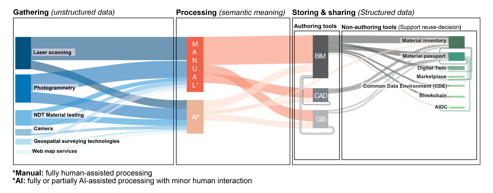
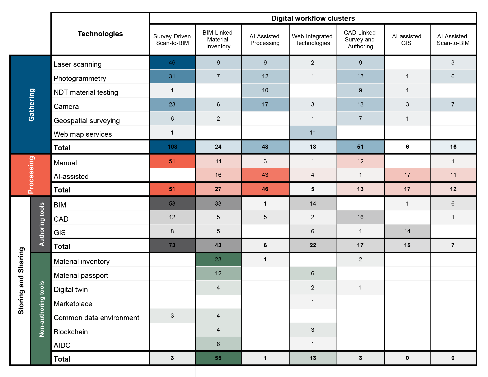

This repository contains materials supporting the paper:

**“The interoperability of digital technologies for the reuse of the building stock: A systematic literature review.”**

It includes figures and the reference list of 241 papers filtered in the review.

